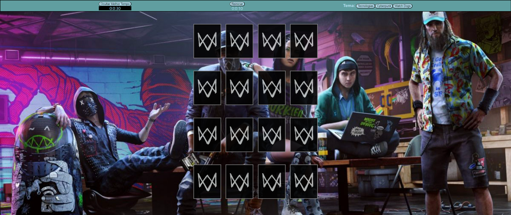
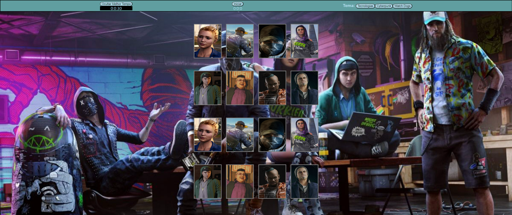
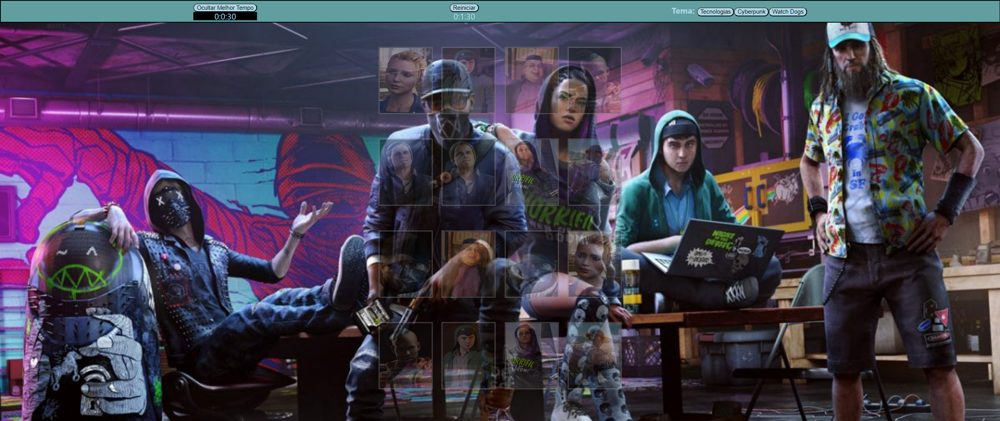
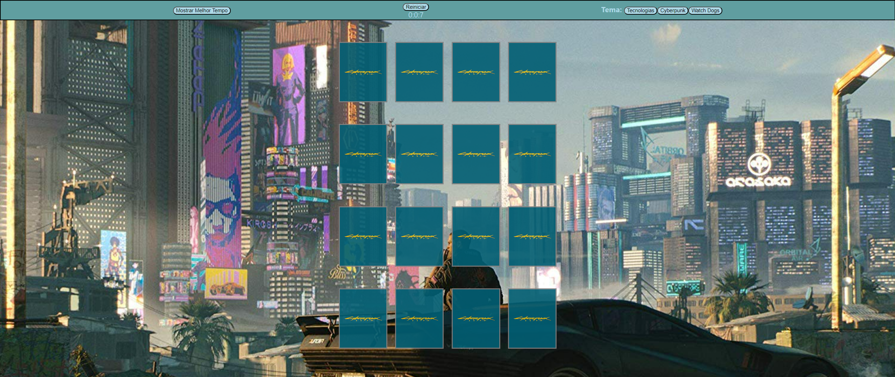

# Instruções para rodar o jogo abaixo

  

- 1 - É necessário ter o node instalado na máquina
- 2 - Entre com "npm install" no terminal
- 3 - Após, entre com "npm start"
- 4 - Acesse "localhost:3000" no navegador

  

  

  

  

  

